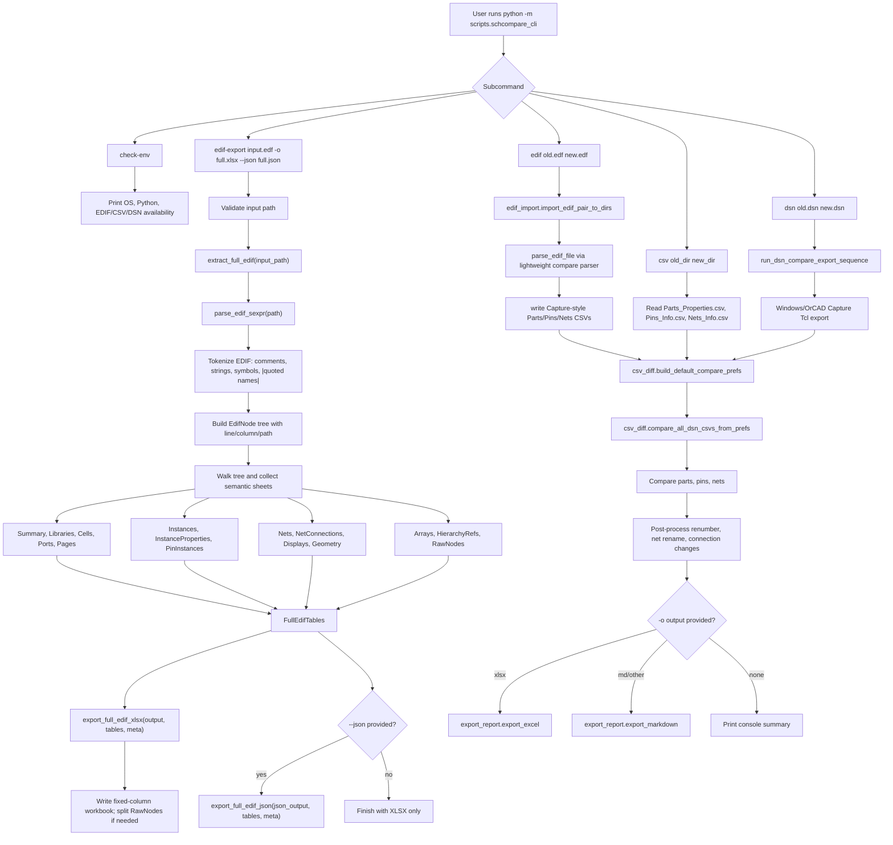

# Code Execution Flow

This diagram covers the main command paths in the current workspace.

## Important Separation

- `scripts.edif_import.py` is the lightweight parser for comparison.
- `scripts.edif_sexpr.py` plus `scripts.edif_full_extract.py` is the full semantic
  extraction path.
- `RawNodes` is the fallback coverage table for EDIF structures that are not yet
  promoted into dedicated semantic sheets.
