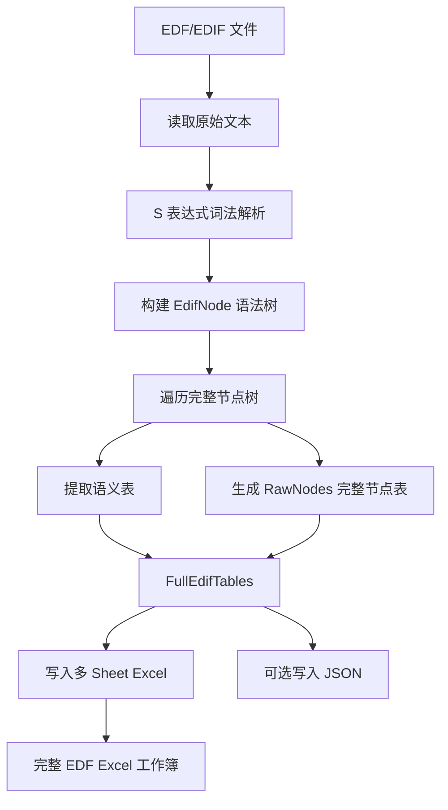
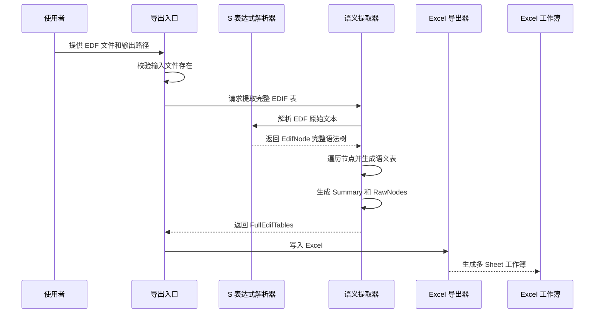

# EDF 文件完整转换为 Excel 的执行流程与方案架构

来源：当前 `edif-full-export` 实现、`PLAN.md` 与 `references/edif_full_export_spec.md`  
适用读者：硬件负责人、EDA 工具开发、原理图数据分析工程师、自动化平台工程师  
阅读目标：理解 EDF 文件如何从原始 EDIF 文本转换为多 Sheet Excel，系统如何保证信息覆盖、语义提取、表格组织和后续可追溯。

## 目录

1. 方案目标
2. 总体架构
3. 核心执行流程
4. 数据流与中间产物
5. Excel 输出结构
6. 关键模块职责
7. 完整性保障机制
8. 方案边界与限制
9. 后续演进方向

## 1. 方案目标

**结论：该方案的目标是把单个 EDF/EDIF 原理图文件尽可能完整地转换为结构化 Excel，而不是只抽取少量可见元件或网络信息。**

当前用户侧已有工具主要围绕 `net`、`instance`、`pin` 三个方向输出信息，能够满足基础连通性查看和局部对象排查，但对于完整理解 EDF 原理图仍然不够。实际工程分析中，除了网络、实例和管脚，还需要看到库定义、cell/view 结构、端口属性、页面信息、器件属性显示位置、坐标、方向、图形对象、array、层级引用以及原始 EDIF 节点来源。如果这些信息没有被提取出来，后续无论是人工复核、问题定位、规则检查，还是进一步做自动化分析，都会缺少上下文。因此需要建设一个更完整的 EDF 信息提取链路，把原始 EDIF 中可保留的信息尽量转换为结构化 Excel。

EDF 文件本质上是 EDIF S 表达式文本，内部包含库、cell、view、端口、页面、器件实例、属性、坐标、显示信息、图形对象、网络连接、array 和层级引用等内容。直接阅读原始文本成本高，也不适合工程师按对象筛选、统计、复核和二次分析。

本方案通过“完整语法树解析 + 语义表提取 + 多 Sheet Excel 导出”的方式，把 EDF 文件拆解成工程师更容易理解的表格结构。

| 目标 | 说明 |
|---|---|
| 完整读取 | 保留 EDIF 原始 S 表达式节点、顺序、层级、行列号和节点路径 |
| 语义提取 | 将常见工程对象提升为独立表格，如实例、属性、管脚、网络、页面、库定义 |
| Excel 交付 | 使用多 Sheet 工作簿承载不同类型信息，便于筛选、统计和评审 |
| 可追溯 | 每条语义数据尽量保留来源路径，无法语义化的信息保留在 RawNodes 中 |
| 可扩展 | 后续可以继续把 RawNodes 中的重要结构提升为新的语义表 |

## 2. 总体架构

**结论：总体架构分为四层：输入层、语法解析层、语义提取层和 Excel 导出层。**

这张架构可以理解为一条从“原始 EDF 文本”到“工程师可读 Excel”的转换流水线。前半段保证原始信息不丢失，后半段负责把信息组织成适合阅读和分析的表格。

| 架构层 | 核心职责 | 关键产物 |
|---|---|---|
| 输入层 | 接收单个 `.edf` 或 `.edif` 文件，读取原始文本 | 原始 EDIF 文本 |
| 语法解析层 | 识别括号、字符串、注释、符号、转义和引用名称，构建完整树 | `EdifNode` 树 |
| 语义提取层 | 从节点树中抽取工程对象，并保留源路径 | `FullEdifTables` |
| 导出层 | 按固定列写入 Excel，多 Sheet 承载不同语义对象 | `.xlsx` 工作簿 |

架构上的核心设计是：先建立完整语法树，再做语义提升。这样可以避免一开始就用规则切文本导致漏字段、丢层级或误判嵌套关系。

## 3. 核心执行流程

**结论：执行流程可以拆成六步：校验输入、解析语法树、提取语义表、汇总统计、写入 Excel、输出结果。**

| 步骤 | 结论 | 说明 |
|---|---|---|
| 1. 校验输入 | 先确认目标 EDF 文件可读取 | 避免后续流程在无效路径上产生空结果 |
| 2. 词法解析 | 将文本拆成括号、字符串、符号和引用名称 | 正确处理注释、字符串中的分号、`|...|` 名称和转义字符 |
| 3. 构建语法树 | 把 EDIF 还原为带层级的 S 表达式树 | 每个 list 节点保留 head、路径、父节点、行列号和子序号 |
| 4. 提取语义表 | 将常见原理图对象提升成表格 | 例如 Libraries、Cells、Ports、Instances、Nets |
| 5. 汇总完整节点 | 生成 RawNodes 作为完整性兜底 | 未被语义化的节点仍可在 RawNodes 中追溯 |
| 6. 写入 Excel | 按固定列输出多 Sheet 工作簿 | 保证交付格式稳定，便于复核、筛选和自动化消费 |

## 4. 数据流与中间产物

**结论：数据从原始文本逐步变成三类中间产物：语法树、语义表、Excel Sheet。**

| 阶段 | 数据形态 | 作用 | 代表字段 |
|---|---|---|---|
| 原始输入 | EDF/EDIF 文本 | 保留设计文件原貌 | 文件路径、文本内容 |
| Token 流 | 词法单元 | 识别 EDIF 的基础结构 | token 类型、原始值、行、列 |
| 语法树 | `EdifNode` / `EdifAtom` | 保留完整嵌套结构 | head、items、parent、path、child_index |
| 语义表 | `FullEdifTables` | 组织工程对象 | sheets、source_path、edif_name |
| Excel Sheet | 多 Sheet 表格 | 面向工程师阅读和分析 | Summary、Instances、Nets、RawNodes 等 |

数据流中最关键的是 `node_path`。它相当于每个 EDIF 节点在树中的地址，用来回答“这个 Excel 单元格里的信息来自原始文件的哪里”。对于后续排查提取逻辑、补充新 Sheet、定位异常节点都很重要。

## 5. Excel 输出结构

**结论：Excel 使用多 Sheet 承载不同层级的 EDIF 信息，其中 RawNodes 是完整性兜底表。**

| Sheet | 主要内容 | 使用价值 |
|---|---|---|
| Summary | 文件路径、EDIF 名称、各类对象数量和原始节点统计 | 快速判断导出规模和覆盖情况 |
| Libraries | 库名称、库属性、来源节点路径 | 查看设计中使用了哪些库 |
| Cells | cell 名称、显示名、类型、属性 | 分析符号或器件模板定义 |
| Ports | 端口名称、方向、封装管脚号、属性 | 查看库符号端口定义 |
| Pages | schematic、page 名称、页面 token、页面属性 | 查看原理图页面组织 |
| Instances | 实例 ID、位号、页面、引用库、坐标、方向、属性 | 查看实际放置到图纸上的器件 |
| InstanceProperties | 器件属性键值、显示名、显示坐标、可见性 | 复核 Value、料号、封装等属性 |
| PinInstances | 实例管脚、管脚号、管脚名、网络名、坐标 | 分析器件管脚和网络绑定关系 |
| Nets | 网络名、页面、连接数量、连接管脚列表 | 查看网络连接概况 |
| NetConnections | 网络到具体实例管脚的连接明细 | 复核连接是否解析成功 |
| Displays | EDIF display 节点、显示坐标、对齐、可见性 | 分析文字显示和属性显示位置 |
| Geometry | 图形对象、点列表、坐标、方向 | 保留图形与走线形态相关信息 |
| Arrays | array 名称、长度、所属对象 | 记录总线或数组结构 |
| HierarchyRefs | instance、viewRef、cellRef、libraryRef 引用关系 | 追踪实例来自哪个符号定义 |
| RawNodes | 完整 S 表达式节点表 | 兜底保存所有未提升为语义表的结构 |

RawNodes 的定位不是给日常阅读使用，而是作为完整性保障。即使某些 EDIF 结构暂时没有独立 Sheet，也不会在导出链路中完全消失。

## 6. 关键模块职责

**结论：当前实现将解析、提取和导出拆成独立模块，降低耦合，也方便后续扩展新 Sheet。**

| 模块 | 职责 | 输入 | 输出 |
|---|---|---|---|
| `scripts/edif_sexpr.py` | 完整解析 EDIF S 表达式 | EDF/EDIF 文件 | `EdifNode` 语法树 |
| `scripts/edif_full_extract.py` | 从语法树提取语义表 | `EdifNode` 树 | `FullEdifTables` |
| `scripts/edif_full_export.py` | 将语义表写入 Excel 或 JSON | `FullEdifTables` | `.xlsx` / `.json` |
| `scripts/schcompare_cli.py` | 提供用户入口并串联流程 | 输入路径、输出路径 | 导出结果 |
| `references/edif_full_export_spec.md` | 记录 Sheet 字段和已知限制 | 当前设计约定 | 可复核的字段说明 |
| `tests/test_edif_full_export.py` | 验证解析、提取、导出和入口行为 | 内联样例和临时文件 | 回归测试结果 |

这种拆分方式让后续增强更明确：如果新增某类 EDIF 结构识别，主要修改语义提取层；如果调整 Excel 栏位，主要修改导出层；如果解析失败，则优先检查 S 表达式解析层。

## 7. 完整性保障机制

**结论：完整性不是靠单个 Sheet 保证，而是由“语法树全量保留 + Summary 计数 + RawNodes 兜底 + 测试验证”共同保证。**

| 机制 | 作用 | 说明 |
|---|---|---|
| 完整 S 表达式树 | 防止早期文本切片丢失嵌套结构 | 每个 list 节点都能被遍历 |
| 行列号记录 | 支持回到原始文件定位问题 | 每个节点保留 1-based line / column |
| 稳定节点路径 | 支持跨表追溯来源 | `node_path` 基于父子层级和 child_index 生成 |
| Summary 统计 | 快速确认导出覆盖规模 | 统计 library、cell、port、page、instance、net 等数量 |
| RawNodes 兜底 | 保存所有 S 表达式 list 节点 | 未进入语义表的信息仍可查看 |
| RawNodes 拆表 | 避免超过 Excel 单 Sheet 行数限制 | 超出限制时生成 RawNodes、RawNodes_2、RawNodes_3 |
| 回归测试 | 保证核心路径稳定 | 覆盖注释、字符串、名称、属性、坐标、网络和 Excel 输出 |

其中最重要的是 RawNodes。它允许 v1 先覆盖主要工程语义，同时保留后续继续深化的空间。后续如果发现某类结构需要独立分析，可以从 RawNodes 定位样例，再提升为新的语义 Sheet。

## 8. 方案边界与限制

**结论：当前方案优先解决“完整导出和可追溯”，不在 v1 阶段强行完成所有高级电气语义推理。**

| 边界 | 当前处理方式 | 后续可能方向 |
|---|---|---|
| 总线与 array | 记录结构和长度，不展开所有位 | 后续按需要展开 bit-level 连接 |
| 跨页网络等价 | 保留页面和网络信息，不做全局高级推断 | 后续增加跨页连接归并 |
| 跨层级网络 | 保留层级引用，不强行扁平化所有网络 | 后续按层级设计规则展开 |
| 属性值结构 | 提取 best-effort 文本，同时保留 raw JSON | 后续针对复杂属性建立专用解析 |
| 图形语义 | 导出 geometry、point_list、origin、orientation | 后续区分符号图形、连线图形和标注图形 |
| 坐标解释 | 保留原始坐标和方向 | 后续结合页面比例、符号变换做可视化还原 |

这些边界的设计原则是：可以暂时不解释，但不能轻易丢失。Excel 是工程师可读交付物，RawNodes 和 JSON 则为后续自动化分析保留更完整的数据基础。

## 9. 后续演进方向

**结论：后续演进应围绕“更多语义提升、更强连接解析、更好的工程复核体验”展开。**

| 演进方向 | 目标 | 价值 |
|---|---|---|
| 总线展开 | 将 array / bus 结构按位展开 | 支持更细粒度网络分析 |
| 跨页连接归并 | 将同名或跨页连接点组织为统一视图 | 降低人工追网络成本 |
| 层级网络扁平化 | 基于 HierarchyRefs 展开跨层级连接 | 支持复杂层级设计分析 |
| Sheet 质量增强 | 增加筛选友好的字段和统计列 | 提升 Excel 直接评审效率 |
| 视觉化辅助 | 基于坐标和几何信息生成页面级结构图 | 帮助工程师理解页面布局 |
| 异常诊断页 | 单独输出未解析、未绑定或疑似异常对象 | 提升数据质量排查效率 |
| 字段规范文档 | 为每个 Sheet 增加业务含义和示例 | 方便团队统一使用口径 |

这套 EDF 到 Excel 的转换方案，当前已经具备从文件读取、完整解析、语义提取到多 Sheet 导出的基础闭环。下一阶段的重点不是重新定义主链路，而是在 RawNodes 覆盖基础上持续提升更多工程语义，让 Excel 从“完整导出表”逐步变成“可直接服务评审和数据分析的原理图信息资产”。
